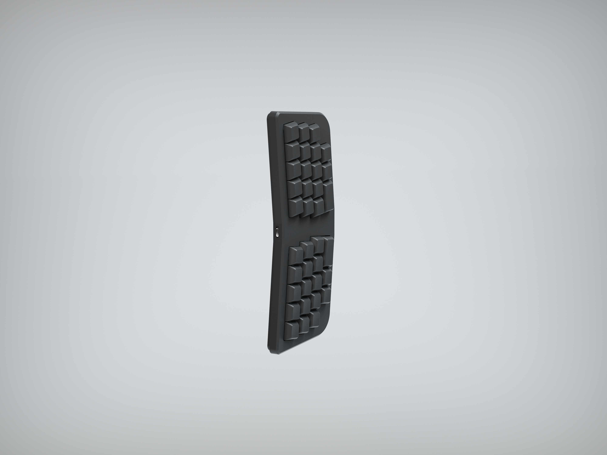

# Little Wing 3D Low Profile version

A 3D printed low profile version of Little Wing keyboard kit designed by LAZYDESIGNERS. Applies Vial firmware.  
由LAZYDESIGNERS设计的Little Wing键盘的一个3D打印矮轴版本。使用vial固件。

Check [Wiki](https://github.com/jackytrabbit/littlewing/wiki) for more info about the project. 
请查看项目的 [Wiki](https://github.com/jackytrabbit/littlewing/wiki)获取更多信息。
